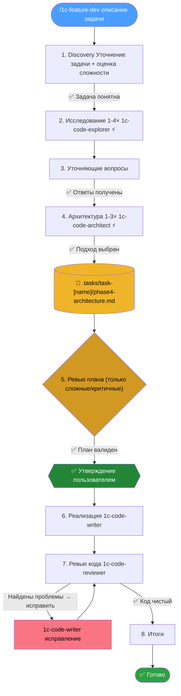

# 1C:Предприятие - AI Feature Development Plugin

Плагин для Claude Code, помогающий дорабатывать существующие конфигурации 1С. Анализирует кодовую базу, проектирует архитектуру, пишет код по стандартам и проверяет качество — через адаптивный воркфлоу с параллельными агентами. Количество агентов и глубина анализа масштабируются в зависимости от сложности задачи.

## Воркфлоу

```
/1c-feature-dev Добавить интеграцию с API складской системы
```



| Фаза | Что происходит |
|------|----------------|
| 1. Discovery | Уточнение задачи + оценка сложности (простая/средняя/сложная/критичная) |
| 2. Исследование | 1-4 агента `1c-code-explorer` адаптивно анализируют кодовую базу — похожие доработки, архитектуру, паттерны |
| 3. Уточняющие вопросы | На основе найденного выявляются неоднозначности. Ждём ответов перед проектированием |
| 4. Архитектура | 1-3 агента `1c-code-architect` проектируют подходы. Пользователь выбирает, план сохраняется в файл |
| 5. Ревью плана | Только для сложных/критичных задач: агент `1c-code-architect` валидирует план до реализации |
| 6. Реализация | Агент `1c-code-writer` пишет код по утверждённому плану. Только после явного одобрения |
| 7. Ревью кода | Агент `1c-code-reviewer` проверяет код. Итеративно: ревью → исправление → повторная проверка (макс. 2 итерации) |
| 8. Итоги | Что построено, ключевые решения, изменённые файлы, следующие шаги |

## Скиллы (команды)

| Команда | Назначение |
|---------|------------|
| `/1c-feature-dev` | Полный воркфлоу разработки доработки (8 фаз) |
| `/1c-query-optimization` | Продвинутые паттерны оптимизации запросов по стандартам ИТС |

## Правила (загружаются автоматически)

| Файл | Назначение |
|------|------------|
| `common-rules.md` | Общие правила: язык ответов, честность, безопасность, ограничения деструктивных операций |
| `1c-rules.md` | Стандарты кодирования 1С |
| `1c-ssl.md` | Работа с БСП: всегда проверять наличие готового решения перед написанием кода |
| `1c-query-optimization.md` | Паттерны оптимизации запросов 1С |
| `1c-edt-metadata.md` | Правила работы с метаданными в EDT формате (`.mdo`, `.form`, и другие XML файлы) — генерации UUID, структура атрибутов |

## Агенты

Можно использовать отдельно, без полного воркфлоу:

| Агент | Модель | Назначение |
|-------|--------|------------|
| `1c-code-explorer` | sonnet | Анализ существующего кода, трассировка выполнения |
| `1c-code-architect` | opus | Проектирование архитектуры с учётом паттернов проекта |
| `1c-code-writer` | sonnet | Написание кода по стандартам из `1c-rules.md` |
| `1c-code-reviewer` | opus | Проверка кода на баги и соответствие стандартам |
| `1c-code-simplifier` | sonnet | Упрощение кода: убрать избыточность, улучшить читаемость |

## Установка для Claude Code

Через маркетплейс (рекомендуется):
```bash
/plugin marketplace add Diversus23/1c-feature-dev
/plugin install 1c-feature-dev
```

Вручную:
```bash
cp agents/*.md ~/.claude/agents/
cp -r skills/* ~/.claude/skills/
cp rules/*.md ~/.claude/rules/
```

## Требования

- Конфигурация 1С, выгруженная в файлы 1C:EDT

### MCP-серверы (устанавливаются отдельно)

| Сервер | Назначение |
|--------|------------|
| [EDT MCP Server](https://github.com/DitriXNew/EDT-MCP) | Справка 1С: проверка синтаксиса, поиск по БСП и метаданным |
| [mcp-bsl-platform-context](https://github.com/alkoleft/mcp-bsl-platform-context) | Контекст платформы BSL: типы, методы, свойства глобального контекста |

## Создано на базе:

- [cursor_rules_1c](https://github.com/comol/cursor_rules_1c/) от comol.
- [feature-dev](https://github.com/anthropics/claude-plugins-official/tree/main/plugins/feature-dev) от Anthropic.
- [1c-feature-dev-workflow](https://github.com/AndreevEvgeniy/1c-feature-dev-workflow) от Andreev Evgeniy.
