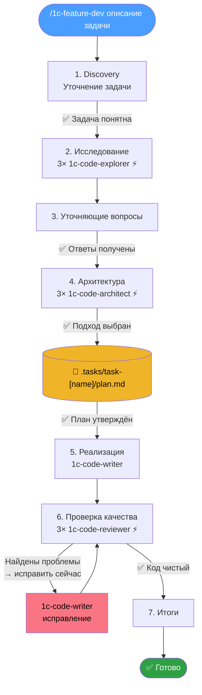

# 1C:Предприятие - AI Feature Development Plugin

Плагин для Claude Code, помогающий дорабатывать существующие конфигурации 1С. Анализирует кодовую базу, проектирует архитектуру, пишет код по стандартам и проверяет качество — через 7-фазный воркфлоу с параллельными агентами.

## Воркфлоу

```
/1c-feature-dev Добавить интеграцию с API складской системы
```



| Фаза | Что происходит |
|------|----------------|
| 1. Discovery | Уточнение задачи: что строим, какие ограничения, какие требования |
| 2. Исследование | 3 агента `1c-code-explorer` параллельно анализируют кодовую базу — похожие доработки, архитектуру, паттерны |
| 3. Уточняющие вопросы | На основе найденного выявляются неоднозначности. Ждём ответов перед проектированием |
| 4. Архитектура | 3 агента `1c-code-architect` предлагают подходы с разными компромиссами. Пользователь выбирает, план сохраняется в файл |
| 5. Реализация | Агент `1c-code-writer` пишет код по утверждённому плану. Только после явного одобрения |
| 6. Проверка качества | 3 агента `1c-code-reviewer` проверяют код. Итеративно: ревью → исправление → повторная проверка |
| 7. Итоги | Что построено, ключевые решения, изменённые файлы, следующие шаги |

## Скиллы

| Команда | Назначение |
|---------|------------|
| `/1c-feature-dev` | Полный воркфлоу разработки доработки (7 фаз) |
| `/1c-ssl` | Справка по подсистемам БСП — поиск готовых решений через `ssl_search` |
| `/1c-query-optimization` | Продвинутые паттерны оптимизации запросов по стандартам ИТС |

## Агенты

Можно использовать отдельно, без полного воркфлоу:

| Агент | Назначение |
|-------|------------|
| `1c-code-explorer` | Анализ существующего кода, трассировка выполнения |
| `1c-code-architect` | Проектирование архитектуры с учётом паттернов проекта |
| `1c-code-writer` | Написание кода по стандартам из `1c-rules.md` |
| `1c-code-reviewer` | Проверка кода на баги и соответствие стандартам |

## Создано на базе:

- [cursor_rules_1c](https://github.com/comol/cursor_rules_1c/) от comol.
- [feature-dev](https://github.com/anthropics/claude-plugins-official/tree/main/plugins/feature-dev) от Anthropic.
- [1c-feature-dev-workflow](https://github.com/AndreevEvgeniy/1c-feature-dev-workflow) от Andreev Evgeniy.